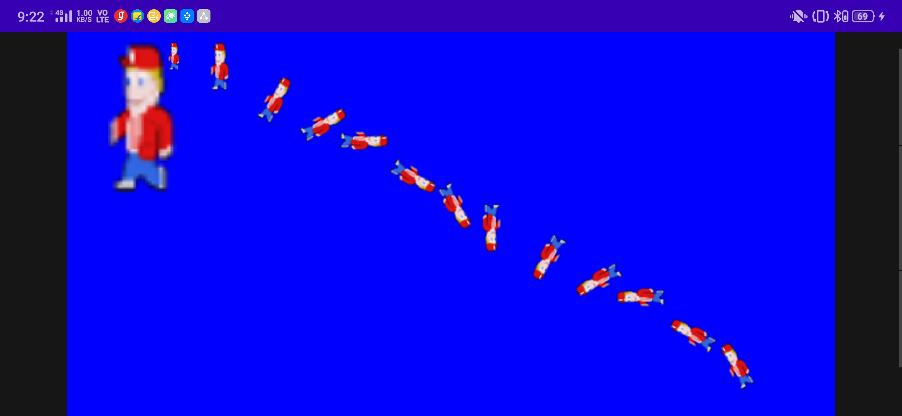

# AnimationBitmaps
Rotate a bitmap 360 degree using canvas, bitmap, imageView and Paint

## Screenshots

## What it includes?
- It includes making a really simple application for rotating a single bitmap to 360 degree and show it on a single canvas. 
- The bitmap will first zoom and then shrink and then rotate by 30 degree and show each output on screen.
